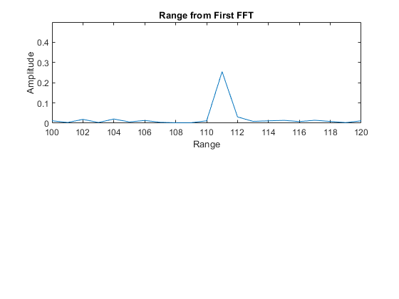
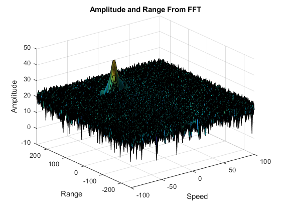
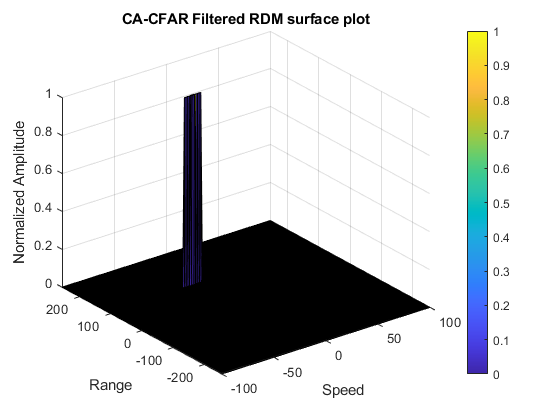

# Sensor Fusion: Radar Target Generation and Detection
Radar Module in the Sensor Fusion Nanodegree

## Implementation steps for the 2D CFAR process
* Loop over elements of RDM array each iteration selecting one cell to be the Cell Under Test 
`row1InitVal = trainCells + guardCells + 1;      ` 
`row1EndVal = (Nr/2) - (trainCells + guardCells);` 
`col1InitVal = trainBand + guardBand + 1;        ` 
`col1EndVal = (Nd) - (trainBand + guardBand);    ` 
`for row1 = row1InitVal : row1EndVal` 
`  for col1 = col1InitVal : col1EndVal`

* For each iteration loop over the training cells "excluding the guarding cells" to sum their values 
`for row2 = row1 - (trainCells + guardCells) : row1 + (trainCells + guardCells)              ` 
`  for col2 = col1 - (trainBand + guardBand) : col1 + (trainBand + guardBand)                ` 
`          ` 
`   absoluteValueRowDifference = abs(row1 - row2);` 
`   absoluteValueColumnDifference = abs(col1 - col2);` 
`          
`    if (absoluteValueRowDifference > guardCells || absoluteValueColumnDifference > guardBand)`

* After that the program calculate threshold from noise average then add Added a pre-determined offset to determine the threshold 
`threshold = pow2db(noise / (2 * (trainBand + guardBand + 1) * 2 * (trainCells + guardCells + 1) - ` 
`                              - (guardCells * guardBand) - 1));                                   ` 
`threshold = threshold + offset;                                                                   `

* If the Cell Under Test is greater than threshold, then the threshold replace it by `1`, else `0`  
`if (cellUnderTest > threshold)` 
`  dopplerMap(row1, col1) = 1; ` 
`else                          ` 
`  dopplerMap(row1, col1) = 0; ` 
`end` 
Whith this the implementation ends.

## Selection of Training, Guard cells and offset
The next values were selected in order to get a clean plot 
For Range and Speed Training Cells. 
* `trainCells = 12;` 
* `trainBand = 6;  ` 
For Range and Speed Guard Cells. 
* `guardCells= 4;  ` 
* `guardBand = 3;  ` 
Offset Value. 
* `offset = 1.2    `  

## Steps taken to suppress the non-thresholded cells at the edges
if the value si not 0 and is not 1, then is not, just set it to 0. 
`dopplerMap(dopplerMap~=0 & dopplerMap~=1) = 0;`

### **Radar Plots**
This is the output for a target at 110m moving at -20 m/s relative speed
 
 
 